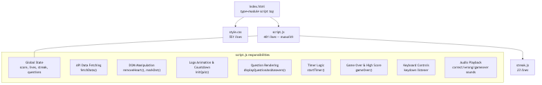
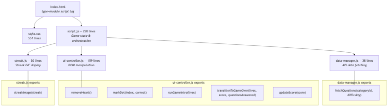

# Trivia Quiz — Refactored

## Task 1: Modular Architecture Proposal

### Current Architecture (Pre-Refactor)

| File | Lines | Responsibility |
|------|-------|----------------|
| `script.js` | 401 | Monolith containing all game logic: global state (score, lives, streak, question index), API data fetching (`fetchData()`), DOM helpers (`removeHeart()`, `markDot()`), logo animation and 3-2-1 countdown, question rendering and answer click handlers, 15-second timer with warning animation, game-over screen transitions and localStorage high score, keyboard controls (1-4 keys, space bar), and audio playback |
| `streak.js` | 23 | Single exported function (`streakImage`) that creates or removes a streak GIF image in the score container based on the current streak count |

**Where concerns are mixed:**

- **Data fetching + DOM reads**: `fetchData()` directly reads `document.getElementById("category-select")` and `document.getElementById("difficulty-select")` to build the API URL, coupling network logic to the DOM
- **UI animation + game initialization**: `initQuiz()` is an 85-line function that handles difficulty-to-lives mapping, heart icon generation, logo animation with `getBoundingClientRect()` and fixed positioning, screen show/hide transitions, countdown overlay creation, and API data awaiting — all in one function
- **Game state + DOM rendering**: `displayQuestionAndAnswers()` mutates `score`, `streak`, and `lives` variables while simultaneously setting `innerHTML`, `backgroundColor`, `disabled` states, and registering `onclick` handlers on answer buttons
- **Timer logic + game state**: `startTimer()` manages both the visual countdown (text content updates, CSS `.timer-warning` class) and game state side effects (decrementing lives, calling `removeHeart()`, triggering `gameOver()`)
- **Screen transitions scattered**: DOM show/hide logic for switching between welcome, game, and game-over screens is split across `initQuiz()` (lines 136-143) and `gameOver()` (lines 332-335)

### Proposed Modular Design (Post-Refactor)

| Module | Lines | Responsibility | Exports |
|--------|-------|----------------|---------|
| `data-manager.js` | 38 | Fetches trivia questions from the Open Trivia DB API or local fallback, accepting category and difficulty as parameters with no DOM dependency | `fetchQuestions(categoryId, difficulty)` |
| `ui-controller.js` | 159 | Handles all direct DOM manipulation for screen transitions, visual feedback (hearts, progress dots, score display), logo animation, countdown overlay, and game-over screen | `removeHeart()`, `markDot(index, correct)`, `runGameIntro(lives)`, `transitionToGameOver(lives, score, questionsAnswered)`, `updateScore(score)` |
| `streak.js` | 30 | Displays or removes a streak GIF image in the score container based on the current consecutive correct answer count | `streakImage(streak)` |
| `script.js` | 258 | Entry point and game orchestrator — owns game state variables, keyboard controls, game loop (question display, answer handling, timer), and coordinates the other three modules | `initQuiz()` (exposed on `window` for `onclick`) |

**Two specific refactors implemented:**

1. **`data-manager.js`** — Extracted `fetchData()` out of `script.js` and refactored it into `fetchQuestions(categoryId, difficulty)`. The function no longer reads DOM elements internally; instead, the caller passes category and difficulty as parameters. This decouples data fetching from the browser DOM.

2. **`ui-controller.js`** — Extracted `removeHeart()`, `markDot()`, the entire logo animation/countdown/heart generation sequence (from `initQuiz()`), and the full game-over screen transition/high score logic (from `gameOver()`). These became `runGameIntro(lives)` and `transitionToGameOver(lives, score, questionsAnswered)` respectively. Also added `updateScore(score)` to replace scattered `getElementById` calls.

---

## Task 2: Implemented Refactor Changes

### Refactor 1: `data-manager.js`

**What was extracted:** The `fetchData()` function from `script.js` (originally lines 186-213).

**What changed:**
- Renamed from `fetchData()` to `fetchQuestions(categoryId, difficulty)` to better describe its purpose and accept explicit parameters
- Removed the two `document.getElementById()` calls that read the category and difficulty dropdowns — the function now receives these values as arguments
- Preserved the API URL construction: base URL with `amount=10&type=multiple`, optional `&category=` and `&difficulty=` query parameters
- Preserved the fallback behavior: if the API fetch fails (rate limit, network error), it loads questions from the local `triviaAPI.json` file
- The caller (`initQuiz()` in `script.js`) now reads `category-select` and `difficulty-select` from the DOM and passes the values to `fetchQuestions()`

**Why:** Data fetching is a distinct concern from game logic and DOM manipulation. By accepting parameters instead of reading the DOM directly, `fetchQuestions()` follows the single responsibility principle and could be tested or reused without a browser environment.

### Refactor 2: `ui-controller.js`

**What was extracted:** Five functions that handle direct DOM manipulation, pulled from multiple locations in the original `script.js`.

- **`removeHeart()`** (originally lines 60-65 of `script.js`) — Moved as-is. Queries all `.heart` elements and removes the last one.
- **`markDot(index, correct)`** (originally lines 68-73) — Moved as-is. Adds a `.correct` or `.wrong` CSS class to the progress dot at the given index.
- **`runGameIntro(lives)`** (originally lines 107-172 of `initQuiz()`) — Extracted the heart icon generation loop, the logo `getBoundingClientRect()` capture and fixed-position pinning, the welcome-to-game screen transitions, the CSS transition animation to the top bar, and the 3-2-1 countdown overlay. Returns a Promise that resolves when the countdown finishes.
- **`transitionToGameOver(lives, score, questionsAnswered)`** (originally the entire `gameOver()` function, lines 325-358) — Extracted all game-over DOM work: disabling answer buttons, hiding/showing screens, setting the win/loss heading text and color, and reading/writing the high score in localStorage.
- **`updateScore(score)`** (new helper) — Replaces the inline `document.getElementById("score").textContent = score` call that appeared in `displayQuestionAndAnswers()`.

**What changed in `script.js`:**
- `initQuiz()` shrank from 85 lines to 25 lines — it reads DOM selections, starts the data fetch, sets the `lives` variable, calls `await runGameIntro(lives)`, then awaits the API data
- `gameOver()` shrank from 34 lines to 1 line — it just calls `transitionToGameOver(lives, score, questionsAnswered)`
- `displayQuestionAndAnswers()` now calls `updateScore(score)`, `markDot()`, and `removeHeart()` as imports instead of local functions
- `startTimer()` now calls `markDot()` and `removeHeart()` as imports

**Why:** DOM manipulation was the largest category of mixed concerns in the original `script.js`. Screen transitions, visual feedback, and UI state updates are a distinct responsibility from game state management and flow control. Centralizing them in `ui-controller.js` means changes to the visual layer (e.g., redesigning the game-over screen) only require editing one file.
